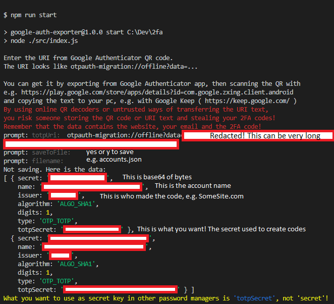

# Google Authenticator 密钥导出工具

> **声明：** 本项目与 Google 没有任何关联。

本工具可以解码 Google Authenticator 导出的 URI，并重新生成二维码用于导入到其他验证器应用。



## 功能特性

- 解码 Google Authenticator 导出的二维码 / URI
- 输出为 JSON 或终端二维码（用于重新导入）
- 支持直接拖拽二维码图片到终端自动识别
- 生成二维码前可编辑账户名称和发行方
- 导入多张二维码图片时自动去重
- 从之前导出的 JSON 文件重新生成二维码
- 支持 TOTP / HOTP、SHA1 / SHA256 / SHA512、6 / 7 / 8 位验证码

## 使用指南

**前置条件：**

- 装有 Google Authenticator 的手机
- 一个摄像头
- 已安装 [Node.js](https://nodejs.org/en/download/)
- （可选）二维码扫描应用（不使用拖拽方式时需要）
  - Android: [ZXing](https://play.google.com/store/apps/details?id=com.google.zxing.client.android)
  - Mac/Win/Linux: [ZBar](https://github.com/mchehab/zbar)（用法参见 [issue 22](https://github.com/krissrex/google-authenticator-exporter/issues/22)）

### 获取导出二维码

1. 打开 Google Authenticator 应用。
2. 点击右上角设置（三个点），选择 *转移账号*。
3. 选择 *导出账号*。
4. 根据提示进行身份验证。
5. 选择要导出的账号（默认为全部）。
6. 点击 *下一步*，拍摄二维码照片。
   - **注意：** 该应用禁止截屏，请使用笔记本摄像头、数码相机或另一部手机拍照。
7. 点击 *下一步*，如果有多个二维码，重复第 6 步。

### 安装

```sh
git clone https://github.com/krissrex/google-authenticator-exporter.git
cd google-authenticator-exporter
npm install
```

### 用法一：拖拽二维码图片（推荐）

最简单的方式 —— 将二维码图片直接拖进终端：

```sh
npm start
```

```text
URI or image path: /path/to/qr-photo.jpg      <- 拖拽图片到这里
  +10 account(s), total: 10

URI or image path (Enter to finish): /path/to/qr2.jpg   <- 继续拖入更多图片，或回车结束
  +5 account(s), total: 15

URI or image path (Enter to finish):           <- 直接回车结束导入

15 account(s) ready.

Output: 1 JSON  2 QR Code (for re-import)
>
```

- 选择 **1** 输出 JSON（可选保存到文件）
- 选择 **2** 在终端显示每个账户的二维码，用手机扫描即可导入到其他应用

支持 PNG、JPEG、WebP 等常见图片格式。多张图片中的重复账户会自动去除。

### 用法二：粘贴 URI

如果你已经通过二维码扫描应用获得了 URI 文本：

```sh
npm start
```

在提示时粘贴 `otpauth-migration://offline?data=...` 格式的 URI。

### 用法三：从 JSON 文件重新生成二维码

如果之前已导出为 JSON 文件，想重新生成二维码：

```sh
node src/index.js --from-json accounts.json
```

直接进入二维码模式，逐个显示账户信息和可扫描的二维码，并支持编辑名称和发行方。

### 二维码模式：编辑账户信息

在二维码模式下，每个账户会显示详细信息和可扫描的二维码。你可以在扫描前修改名称和发行方：

```text
  Account 1/3
  Name:      old-account-name
  Issuer:    OldService
  Algorithm: SHA1
  Digits:    6
  Type:      TOTP

  [二维码]

  New name (Enter to keep): my-new-name        <- 输入新名称，或回车跳过
  New issuer (Enter to keep): NewService

  Account 1/3                                  <- 更新后的信息和二维码立即显示
  Name:      my-new-name
  Issuer:    NewService
  ...

==================================================

  Account 2/3
  ...
```

## 使用 Docker

**前置条件：**

在本地构建 Docker 镜像：

```sh
docker build . --tag google-authenticator-exporter:0.0.1
```

**解码二维码 URI：**

1. 运行 Docker 容器：

```sh
docker run -it --rm google-authenticator-exporter:0.0.1
```

2. 在提示时输入 URI。
3. 由于没有挂载卷，无法保存文件输出，直接回车跳过保存。
4. JSON 数据将直接打印到终端。

## 参考

- Protobuf 定义来源：<https://github.com/beemdevelopment/Aegis/pull/406/files>
- 开源 Google Authenticator 尚未支持此功能（*2020 年 5 月*）：<https://github.com/google/google-authenticator-android/issues/118>
- Android 二维码扫描应用：<https://play.google.com/store/apps/details?id=com.google.zxing.client.android>
- Base32 规范：<https://tools.ietf.org/html/rfc3548>

## 许可证

MIT 许可证，**但是**项目依赖了 GNU GPL 3 协议的代码（[google_auth.proto](https://github.com/alexbakker/Aegis/blob/56bde0e19b51568a7050f6cb56085a1bb38c5a9e/app/src/main/proto/google_auth.proto)，[LICENSE](https://github.com/alexbakker/Aegis/blob/56bde0e19b51568a7050f6cb56085a1bb38c5a9e/LICENSE)）。
